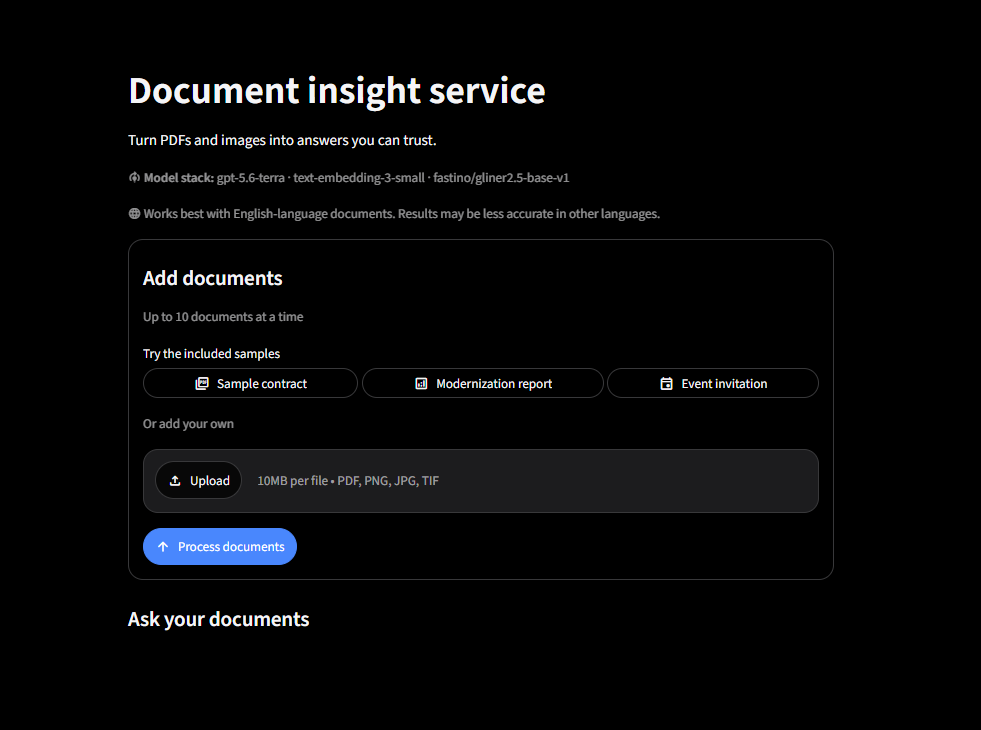
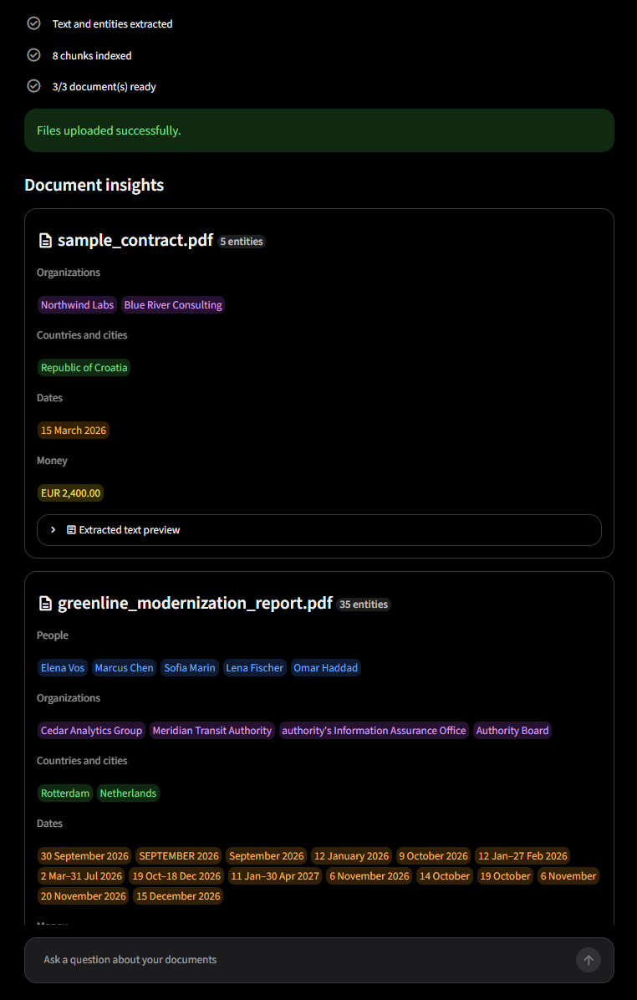
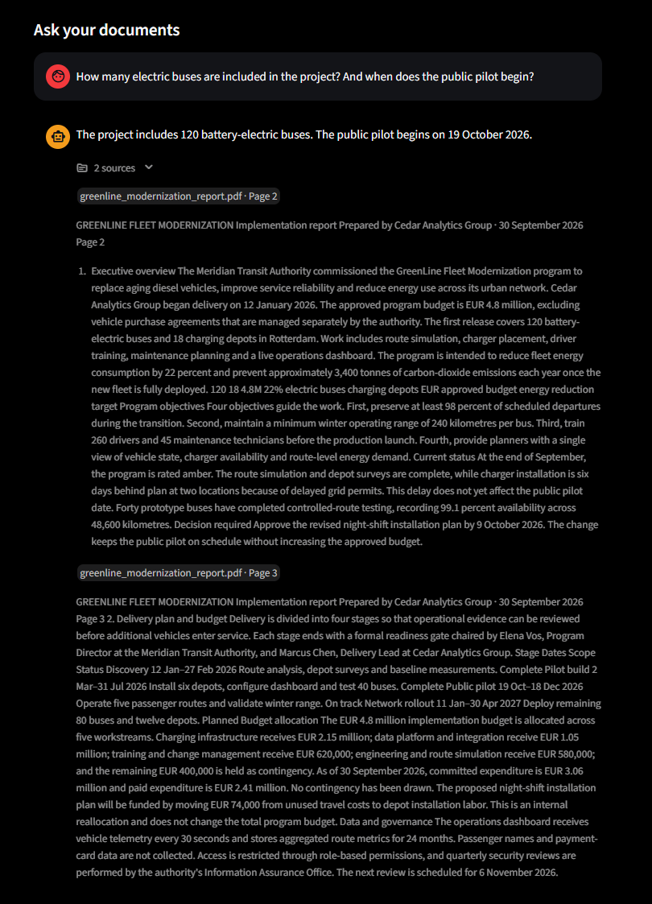
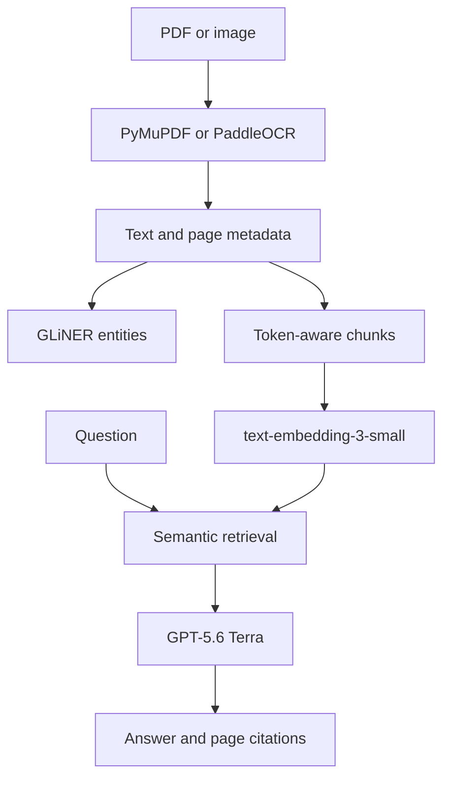

# Document insight service

An AI-powered FastAPI service that extracts text and named entities from PDFs
and images, retrieves relevant passages with semantic embeddings, and answers
questions with page-aware source citations. A Streamlit interface provides a
polished workflow for trying the API and the included sample documents.

## Features

- Upload up to 10 PDF, PNG, JPG, or TIFF documents, with a 10 MiB limit per file.
- Extract embedded PDF text with PyMuPDF and use PaddleOCR for scanned PDF pages
  and images.
- Detect people, organizations, locations, dates, and monetary values with a
  local GLiNER model.
- Split text into overlapping, token-aware chunks and retrieve the most relevant
  passages using OpenAI embeddings and cosine similarity.
- Generate grounded answers with GPT-5.6 Terra and return the supporting
  document, page number, and excerpt.
- Try three included documents directly from the Streamlit interface.
- Surface clear validation errors and concise processing progress.

The application works best with English-language documents. OCR quality also
depends on image resolution, layout, and scan quality.

## Interface

<p align="center">
  <a href="images/1.png">
    
  </a>
</p>

<p align="center"><em>Upload your own documents or start with an included sample.</em></p>

<p align="center"><strong>Extracted document insights</strong></p>

<p align="center">
  <a href="images/2.png">
    
  </a>
</p>

<p align="center"><strong>Grounded answers and page-aware citations</strong></p>

<p align="center">
  <a href="images/3.png">
    
  </a>
</p>

## How it works



Text is divided into 500-token chunks with a 100-token overlap. The service
embeds each chunk with `text-embedding-3-small`, embeds the question, and ranks
chunks by cosine similarity. The five most relevant chunks are sent to
`gpt-5.6-terra`, which returns a structured answer and the identifiers of the
passages that directly support it.

The API stores the latest uploaded documents and their embeddings in process
memory. Uploading another set replaces them, and restarting the API clears them.
This keeps the demonstration small and dependency-free; a production system
would use isolated user sessions and persistent storage.

## Technology choices

| Tool | Purpose | Why it was chosen |
| --- | --- | --- |
| FastAPI | REST API | Typed request and response models, validation, and generated API documentation |
| PyMuPDF | PDF extraction | Fast page-aware extraction of embedded PDF text |
| PaddleOCR | OCR | Well-known OCR toolkit used lazily only when a page or image requires it |
| GLiNER 2.5 | Named-entity recognition | Local, configurable entity extraction without another hosted inference call |
| OpenAI embeddings | Semantic retrieval | Strong retrieval quality with minimal infrastructure |
| GPT-5.6 Terra | Question answering | Produces concise grounded answers and structured source selection |
| Streamlit | Demo interface | Makes the complete document workflow immediately testable |

## Sample documents

The repository includes:

- `sample_contract.pdf` — a short consulting agreement.
- `greenline_modernization_report.pdf` — a longer, multi-page transport project
  report designed to demonstrate retrieval and page citations.
- `event_invitation.png` — an image document that exercises OCR.
- `expected_answers.md` — representative questions and expected answers for
  manual verification.

## Manual setup

### Requirements

- Python 3.11+
- [uv](https://docs.astral.sh/uv/)
- An OpenAI API key

Create the local environment file:

```bash
cp .env.example .env
```

On Windows PowerShell, use `Copy-Item .env.example .env`. Then replace the
placeholder in `.env` with your API key.

Install the locked dependencies:

```bash
uv sync
```

Start the API:

```bash
uv run uvicorn main:app --reload
```

In a second terminal, start the interface:

```bash
uv run streamlit run streamlit_app.py
```

Open:

- Streamlit UI: <http://localhost:8501>
- Interactive API documentation: <http://localhost:8000/docs>

The NER and OCR model files are downloaded on first use, so the first document
may take longer to process. OCR is initialized lazily and is not loaded for PDFs
that already contain extractable text.

## Docker

### Requirements

- Docker with Docker Compose
- An `.env` file containing `OPENAI_API_KEY`

Build and start both services:

```bash
docker compose up --build
```

Then open <http://localhost:8501>. The FastAPI documentation is available at
<http://localhost:8000/docs>.

Stop the application with:

```bash
docker compose down
```

## API examples

The `/index` endpoint is called explicitly by the UI so it can show extraction
and embedding as separate progress steps. API clients may skip it: `/ask`
automatically creates the index when necessary.

### Upload documents

```bash
curl -X POST http://localhost:8000/upload \
  -F "files=@sample_documents/sample_contract.pdf" \
  -F "files=@sample_documents/greenline_modernization_report.pdf"
```

Abridged response:

```json
{
  "documents": [
    {
      "filename": "sample_contract.pdf",
      "text": "Page 1\nConsulting Services Agreement...",
      "entities": [
        {
          "text": "Northwind Labs",
          "label": "ORG",
          "start": 82,
          "end": 96,
          "confidence": 0.99
        }
      ]
    }
  ],
  "message": "Files uploaded successfully."
}
```

### Create the semantic index

```bash
curl -X POST http://localhost:8000/index
```

```json
{
  "message": "Document embeddings created successfully.",
  "chunk_count": 7
}
```

### Ask a question

```bash
curl -X POST http://localhost:8000/ask \
  -H "Content-Type: application/json" \
  -d '{"question":"What is the approved implementation budget?"}'
```

Representative response:

```json
{
  "question": "What is the approved implementation budget?",
  "answer": "The approved implementation budget is EUR 4.8 million.",
  "sources": [
    {
      "filename": "greenline_modernization_report.pdf",
      "page_number": 2,
      "excerpt": "...The approved implementation budget is EUR 4.8 million..."
    }
  ]
}
```

## Configuration

| Variable | Default | Description |
| --- | --- | --- |
| `OPENAI_API_KEY` | None | Required API credential |
| `OPENAI_MODEL` | `gpt-5.6-terra` | Model used for grounded answers |
| `OPENAI_EMBEDDING_MODEL` | `text-embedding-3-small` | Model used for semantic retrieval |
| `API_URL` | `http://localhost:8000` | Backend address used by Streamlit |
